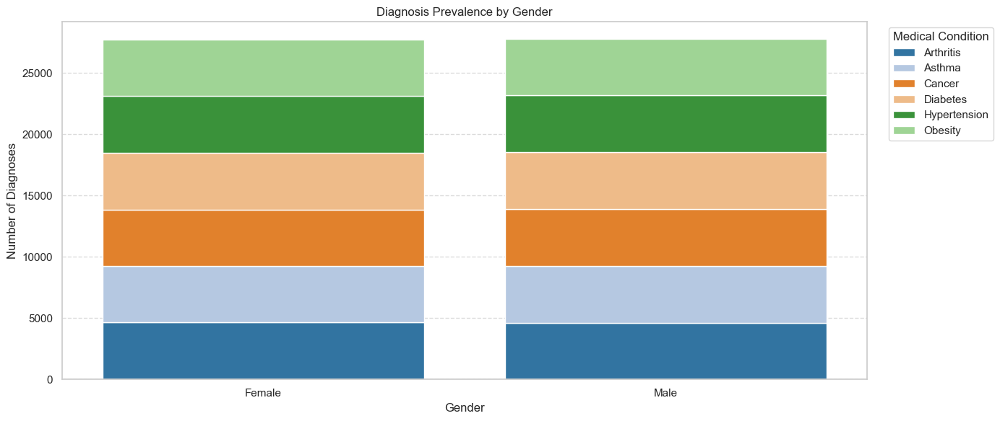
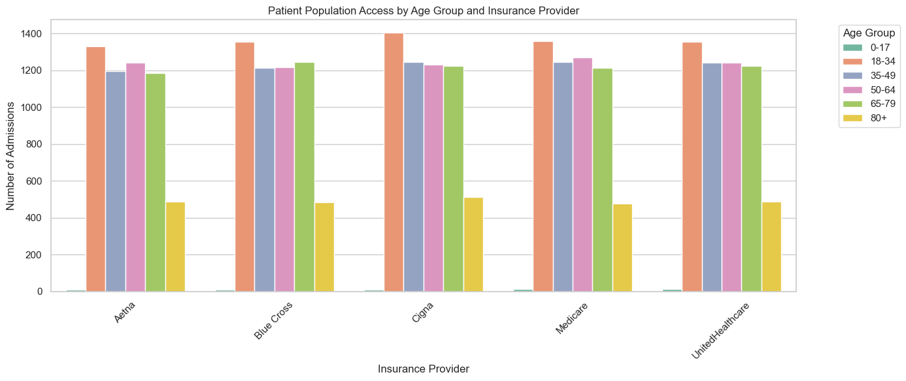
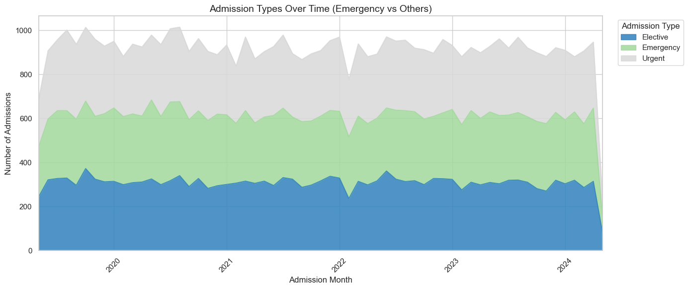
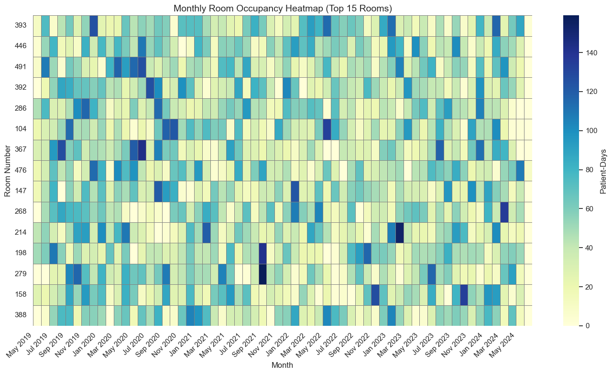
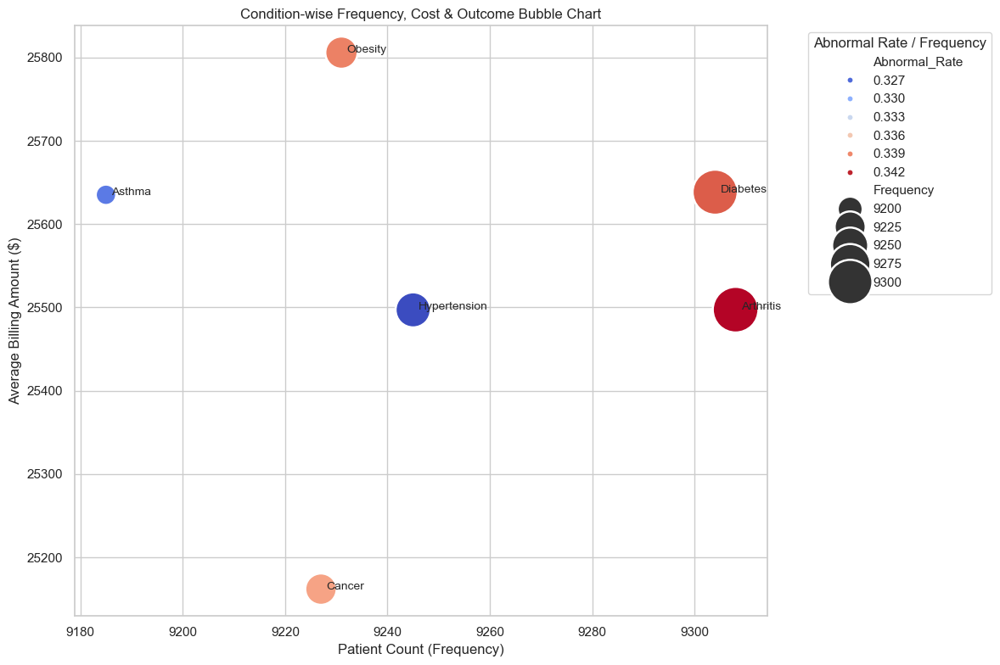
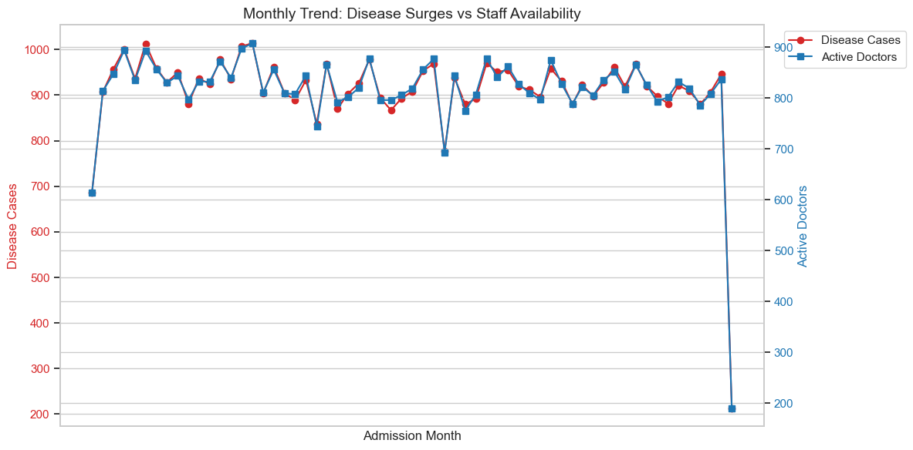
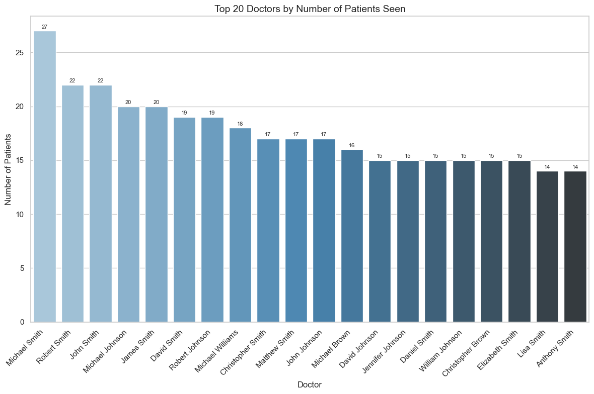

# OVERVIEW
Welcome to my healthcare analysis, which aims to guide health facility in making informed decision using healthcare dataset. This Project is one of my Portfolio projects towards the completion of my course in Python for Data Analytics offered by Regonet Global. This project seeks to offer data-driven solution for potential issues in healthcare facilities.

The dataset is synthetic which was created to provide valuable resource for data analyst. The data was designed to mimic real-world healthcare data so as to enable analysts profer near real-world solution to probable  problems faced by healthcare industry.

# The Questions
Below are the questions I seek to answer in my analysis:
1. Are certain medical conditions more prevalent in one gender compared to the other?
2. Which age and gender groups are underrepresented in hospital admissions?
3. Are emergency admissions overwhelming elective service and straining resources?
4. Is there a rising demand for impatient care that indicates the need for ward or ICU expansion?
5. Which medical condition contributes most to hospital billing and costs
6. Do disease incidence and staffing needs vary by season or months?
7. Are some doctors managing significantly higher patient loads than others?

# Tools I Used
I harnessed the functionality of several key tools for my analysis of the healthcare dataset analysis.

Python was the backbone of my analysis which enables me to analyze the data and provide critical insights

I also deployed the following Python libraries:

1. Pandas Library: This was used to analyze the data.
2. Matplotlib Library: I used it to visualized the data.
3. Seaborn Library: Helped me create more advanced visuals.
4. Visual Studio Code: My go-to for executing my python scripts
5. Jupyter Notebooks: The tools I used to run my Python scripts which let me easily include my noted and analysis.
6. Git & GitHub: Essential for version control and sharing my Python code and analysis, ensuring collaboration and project tracking.

# Data Preparation and Cleanup
This section outlines the steps taken to prepare the data for analysis, ensuring accuracy and usability.

Import and Cleanup Data: I began by importing neccessary libraries and loading the dataset, followed by initial data cleaning tasks to ensure data quality.

``` Python
# Importing necessary libraries
import pandas as pd
import streamlit as st
import matplotlib.pyplot as plt
from datasets import load_dataset
from adjustText import adjust_text
import seaborn as sns
import re
from datetime import datetime
import plotly.express as px
%matplotlib inline

# loading the dataset
health = pd.read_csv(r"C:\Users\DELL\Desktop\Regonet_project\healthcare_dataset.csv")

# Creating a copy of the dataset
health_1 = health.copy()

# Removing extra leading and trailing spaces from text-based columns
for col in health_1.select_dtypes(include='object'):
    health_1[col] = health_1[col].map(lambda x: re.sub(r'\s+', ' ', x).strip() if isinstance(x,str) else x)
    
# Converting the name coulmn to title case
health_1['Name'] = health_1['Name'].str.title()

# Renaming some columns to comply with python naming conventions
health_1.rename(columns={'Blood Type': 'Blood_Type','Medical Condition': 'Medical_Condition', 
                         'Date of Admission': 'Date_of_Admission', 'Insurance Provider': 'Insurance_Provider',
                         'Billing Amount': 'Billing_Amount','Room Number':'Room_Number',
                         'Admission Type':'Admission_Type', 'Discharge Date': 'Discharge_Date',
                         'Test Results':'Test_Results'
}, inplace=True)

# Converting the Date of Admission and Discharge Date to datetime format
health_1['Date_of_Admission'] = pd.to_datetime(health_1['Date_of_Admission'], errors='coerce').dt.strftime('%Y-%m-%d')
health_1['Discharge_Date'] = pd.to_datetime(health_1['Discharge_Date'], errors='coerce').dt.strftime('%Y-%m-%d')

# cleaning the Hospital column by removing commas and extra spaces
health_1['Hospital'] = (
    health_1['Hospital']
    .str.replace(',', '', regex=False) 
    .str.strip()                         
)

# Converting billing amount coulmn to 2 decimal palces
health_1['Billing_Amount'] = health_1['Billing_Amount'].round(2)

# checking dataet after cleaning
health_1.sample(10, random_state=42)
```

# The Anlysis

## 1. Assessing Gender Disparities in the Prevalence of Medical Conditions

### Visualizing Data

``` python
plt.figure(figsize=(14, 6))
palette = sns.color_palette("tab20", n_colors=grouped['Medical_Condition'].nunique())

# Using pandas crosstab to plot stacked bars
pivot_df = pd.crosstab(health_1['Gender'], health_1['Medical_Condition'])

# Plotting of stacked bars
bottom = pd.Series([0]*len(pivot_df), index=pivot_df.index)
for i, condition in enumerate(pivot_df.columns):
    sns.barplot(x=pivot_df.index, y=pivot_df[condition], label=condition,
                bottom=bottom, color=palette[i])
    bottom += pivot_df[condition]
    
plt.title("Diagnosis Prevalence by Gender")
plt.xlabel("Gender")
plt.ylabel("Number of Diagnoses")
plt.xticks(rotation=0)
plt.grid(axis='y', linestyle='--', alpha=0.7)

# Positioning of legend
plt.legend(title='Medical Condition', bbox_to_anchor=(1.02, 1), loc='upper left')
plt.tight_layout()
plt.show()
``` 
###   Results


### Insights:
- The most prevalent medical condition is Arthritis with 9308 total diagnoses.
- Asthma shows the greatest gender disparity with a difference of 79 diagnoses.
- The least diagnosed condition is Asthma, with only 9185 cases recorded.

### Recommendations:
Facility should consider:
- Increasing resource allocation for Arthritis — including screening, education, and chronic care.
- Investigating possible causes for gender disparity in Asthma, such as access barriers or cultural stigma.
- Assessing  whether Asthma is genuinely rare or underdiagnosed due to low screening rates or awareness.

## 2. Identifying Underserved Demographics Across Patient Populations

### Visualizaing data
``` python
# Defining color palette
palette = sns.color_palette("Set2", len(labels))

# Plotting of  bar chart
plt.figure(figsize=(14, 6))
sns.barplot(
    data=grouped,
    x='Insurance_Provider',
    y='Admission_Count',
    hue='Age_Group',
    palette=palette,
    errorbar=None 
)

plt.title("Patient Population Access by Age Group and Insurance Provider")
plt.xlabel("Insurance Provider")
plt.ylabel("Number of Admissions")
plt.xticks(rotation=45)
plt.legend(title="Age Group", bbox_to_anchor=(1.05, 1), loc='upper left')
plt.tight_layout()
plt.show()
```
##  Results



### Insights:
- The lowest access was observed among Female patients aged 0-17 under Aetna, with only 6 recorded admissions.
- The age group with overall lowest utilization is 0-17, with only 116 total admissions across all genders and insurance providers.
- Aetna has the lowest total patient engagement, with only 10913 admissions recorded.

### Recommendations:
Facility should consider:
- Investigating barriers (e.g., cost, cultural beliefs, transport) for Female patients aged 0-17 with Aetna. 
- Offering tailored outreach programs.
- Creating awareness or mobile care services targeting individuals aged 0-17.
- Collaborating with Aetna to assess member access issues and improve coverage incentives.

## 3. Comparing Emergency and Elective Admissions to Assess Service Strain

### Visualizaing data
``` python
# Plotting of  stacked area chart
fig, ax = plt.subplots(figsize=(14, 6))
pivot_df.plot(kind='area', stacked=True, colormap='tab20c', alpha=0.85, ax=ax)

plt.title("Admission Types Over Time (Emergency vs Others)", fontsize=14)
plt.xlabel("Admission Month")
plt.ylabel("Number of Admissions")
plt.xticks(rotation=45)
plt.grid(True)

# Moving of  legend outside the plot
plt.legend(title='Admission Type', bbox_to_anchor=(1.02, 1), loc='upper left')
plt.tight_layout()
plt.show()
```
### Results


### Insights:
- Emergency admissions peaked in May 2020 with 358 cases, which is above the average monthly emergency admission of 299.

### Recommendations:
Facility should consider:
- Examining  what occurred in May 2020 to drive the spike
- Considering  adding more non-emergency capacity or triage to better manage future peaks.

## 4. Accessing Ward Capacity Utilization Rate

### Visualizaing Data
``` python
ax.set_xticks(selected_locs)
ax.set_xticklabels(selected_labels, rotation=45, ha='right')

plt.title("Monthly Room Occupancy Heatmap (Top 15 Rooms)", fontsize=14)
plt.xlabel("Month")
plt.ylabel("Room Number")
plt.yticks(rotation=0)
plt.tight_layout()
plt.show()
```
### Results


### Insights:
- Room 393 had the highest occupancy over the observed period with 3050 patient-days.
- Room 388 had the lowest occupancy with only 2739 patient-days.
- The busiest month was September 2019, with 976 total patient-days across rooms.

### Recommendations:
Facility should consider:
- Consider redistributing traffic or replicating facilities in Room 393 to prevent overuse.
- Investigate Room 388 for possible operational issues (e.g., equipment, staffing, isolation).
- Plan staffing and infrastructure adjustments for high-traffic periods like September 2019.

## 5. Analyzing which Medical Conditions Generate the Highest Costs.

### Visualizing Data
``` python
# Plotting Bubble Chart (Frequency vs Billing, size = Frequency, hue = Abnormal Rate)
plt.figure(figsize=(12, 8))
bubble = sns.scatterplot(
    data=condition_summary,
    x='Frequency',
    y='Avg_Billing_Amount',
    size='Frequency',
    hue='Abnormal_Rate',
    palette='coolwarm',
    sizes=(300, 1500),
    legend='brief'
)

# Annotating points with condition names
for i in range(condition_summary.shape[0]):
    row = condition_summary.iloc[i]
    plt.text(row['Frequency'] + 1, row['Avg_Billing_Amount'], row['Medical_Condition'], fontsize=10)

# Placing legend outside
plt.legend(bbox_to_anchor=(1.05, 1), loc='upper left', title='Abnormal Rate / Frequency')
plt.title("Condition-wise Frequency, Cost & Outcome Bubble Chart")
plt.xlabel("Patient Count (Frequency)")
plt.ylabel("Average Billing Amount ($)")
plt.grid(True)
plt.tight_layout()
plt.show()
```
### Results


### Insights:
- Arthritis is the most common condition with 9308 patients.
- Obesity has the highest average billing at $25805.97.
- Arthritis shows the highest abnormal outcome rate at 34.3%.

### Recommendations:
Facility should consider:
- Organizing preventative campaigns for Arthritis, which could reduce long-term admissions.
- Conducting a billing audit and care-pathway optimization for Obesity.
- Reviewing clinical guidelines and aftercare plans for Arthritis.

## 6. Tracking monthly disease risk & seasonal staffing needs

### Visualizing Data
``` python
# Plotting Dual-axis line plot
sns.set(style="whitegrid")
fig, ax1 = plt.subplots(figsize=(12, 6))

color1 = 'tab:red'
ax1.set_xlabel('Admission Month')
ax1.set_ylabel('Disease Cases', color=color1)
line1 = ax1.plot(trends.index, trends['Disease_Cases'], color=color1, marker='o', label='Disease Cases')
ax1.tick_params(axis='y', labelcolor=color1)
ax1.set_xticks(range(len(trends.index)))
ax1.set_xticklabels(trends.index.strftime('%b %Y'), rotation=45, ha='right')

# Second axis for staff
ax2 = ax1.twinx()
color2 = 'tab:blue'
ax2.set_ylabel('Active Doctors', color=color2)
line2 = ax2.plot(trends.index, trends['Active_Doctors'], color=color2, marker='s', label='Active Doctors')
ax2.tick_params(axis='y', labelcolor=color2)

# Combining  legends
lines = line1 + line2
labels = [l.get_label() for l in lines]
ax1.legend(lines, labels, loc='upper left', bbox_to_anchor=(1.02, 1))

plt.title("Monthly Trend: Disease Surges vs Staff Availability", fontsize=14)
plt.tight_layout()
plt.show()
```
### Results


### Insights:
- Disease cases peaked in August 2020** with 1014 reported cases.
- The lowest staff availability was in May 2024 with only 190 active doctors.

### Recommendations:
Facility should consider:
- Allocate more staff and resources ahead of August 2020 in future cycles.
- Review scheduling practices to avoid low staffing during critical periods like May 2024.

## 7. Comparing Doctors' Workloads

### Visualizing Data
``` python
# Plotting bar chart
plt.figure(figsize=(12, 8))
ax = sns.barplot(
    data=doctor_summary,
    x='Doctor',
    y='Patients_Seen',
    hue='Doctor',
    palette='Blues_d',
    dodge=False,
    legend=False 
)

plt.title("Top 20 Doctors by Number of Patients Seen", fontsize=14)
plt.xlabel("Doctor")
plt.ylabel("Number of Patients")
plt.xticks(rotation=45, ha='right')
plt.tight_layout()

# Moving legend outside the plot
for container in ax.containers:
    ax.bar_label(container, fmt='%d', label_type='edge', fontsize=8, padding=2)

plt.show()
```
### Results


### Insights:
- Michael Smith attended to the most patients, 27 in the review period.
- David Johnson had the highest abnormal outcome rate at 53.3%.
- William Johnson had the highest average billing at $31279.88 per patient.

### Recommendations:
Facility should consider:
- Reducing workload for Michael Smith to prevent burnout or quality issues.
- Investigating David Johnson's treatment or triage practices for quality improvement.
- Reviewing case complexity and billing justification for William Johnson to optimize cost-efficiency.

## What I Learned
In the course of the project, I developed my understanding on how to use data to solve real healthcare challenges and improved my technical skills in python, especially in data manipulation and visualization. Here are a few specific concepts I learned:

- Advanced Python Usage: Utilizing libraries such as Pandas for data manipulation, Seaborn and Matplotlib for data visualization, and other libraries helped me perform complex data analysis tasks more efficiently.
- Data Cleaning importance: I learned that thorough data cleaning and preparation are crucial before any meaningful analysis can be conducted, ensuring the accuracy of insights derived from the data.

## General Insights
This dataset offers several general insights for healthcare facilities:
- Arthritis is the most prevalent and risk-prone condition, with 9,308 diagnoses and the highest abnormal outcome rate at 34.3%.
- Asthma has the greatest gender disparity in diagnoses and is also the least reported condition, with only 9,185 cases.
- Female patients aged 0–17 under Aetna insurance had the lowest recorded access to care, with just 6 admissions.
- Obesity and Arthritis are the costliest conditions, with Obesity averaging $25,805.97 per patient and Arthritis showing high frequency and abnormality.
- Physician and resource utilization varied significantly—Michael Smith handled the most patients (27), while William Johnson led in billing per patient ($31,279.88), and David Johnson had the highest abnormal test rate (53.3%).

### General Recommedations
Below are my recommedations for healthcare facility based on my indept analysis of the dataset.

- Increase targeted support for Arthritis through enhanced screening, chronic care programs, and clinical review to reduce abnormal outcomes and long-term admissions.
- Investigate access and diagnostic barriers in underrepresented groups, particularly asthma in females and young patients aged 0–17 under Aetna.
- Strengthen outreach and mobile services for low-access demographics, especially children and adolescents, to improve early detection and care.
- Optimize infrastructure and staffing based on room usage and seasonal demand patterns, ensuring better preparedness for high-traffic periods and underutilized spaces.
- Monitor physician workloads and outcomes—adjusting schedules, reviewing care quality, and auditing billing practices to improve efficiency and reduce risks.

### Challenges I Faced
This task pesents certain challenges which I turned into good learning experiences:

- Data Inconsistencies: Handling missing or inconsistent data entries requires careful consideration and thorough data-cleaning techniques to ensure the integrity of the analysis.
- Complex Data Visualization: Designing effective visual representations of complex datasets was challenging but critical for conveying insights clearly and compellingly.
- Balancing Breadth and Depth: Deciding how deeply to dive into each analysis while maintaining a broad overview of the data landscape required constant balancing to ensure comprehensive coverage without getting lost in details

### Conclusion
This exploration into healthcare analysis has been highly informative, emphasizing how potential healthcare  challenges could be surmounted through insights from data. The insights I obtained improved my uderstanding and provided actionable guidance for healthcare facilities.